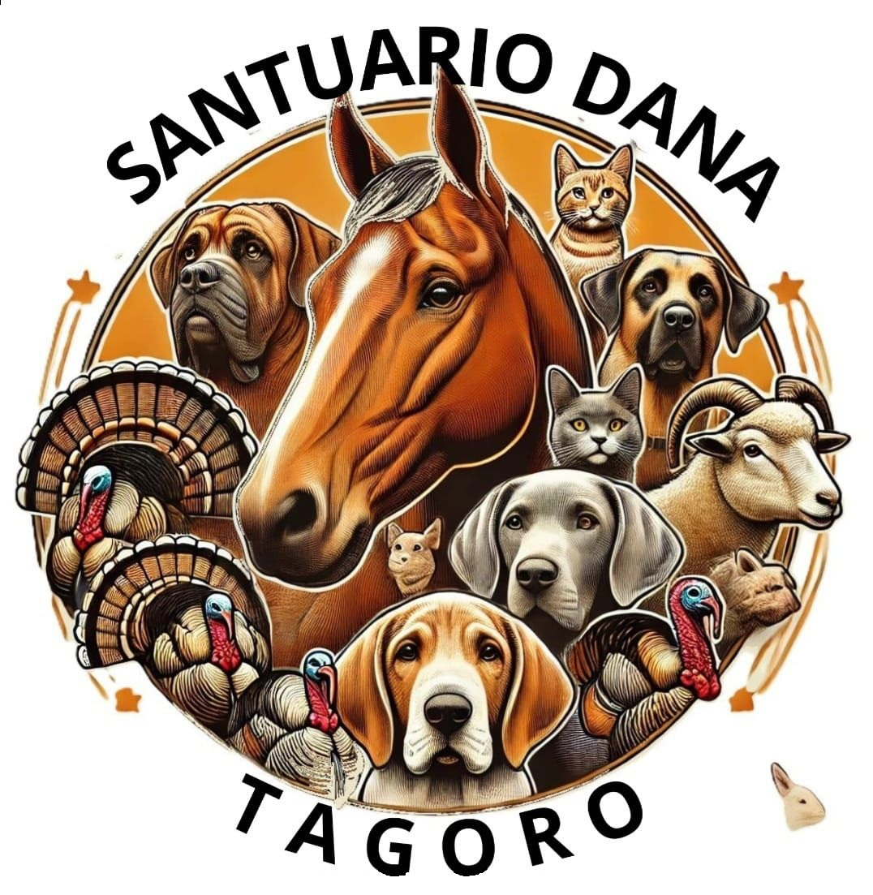

# 🐾 Santuario Dana Tagoro - Support Website 🌿

### A website built to support the **Santuario Dana Tagoro**, a sanctuary dedicated to rescuing and caring for animals affected by the Dana disaster in Valencia, Spain.

## 🏡 About This Project

This website was developed **altruistically** to assist the **Santuario Dana Tagoro**, a refuge for animals that have been lost, abandoned, or affected by the catastrophic Dana storm in Valencia.

Our goal is to provide the sanctuary with a **professional, user-friendly platform** where people can:
- **Donate** to help with medical care, food, and shelter.
- **Volunteer** and offer hands-on help at the sanctuary.
- **Spread awareness** by sharing the sanctuary’s work and mission.

## 🎯 Features
- 📌 **Informational sections** about the sanctuary's work.
- 💚 **Donation page** with banking details to support the cause.
- 🤝 **Volunteer opportunities** to help directly at the sanctuary.
- 📢 **Social media integration** to spread awareness and updates.

## 💡 How You Can Help
If you want to **support this project**, you can:
1. **Share the website** to help raise awareness.
2. **Donate directly** to the sanctuary (bank details provided on the site).
3. **Contribute to development** by improving the code or adding new features.

## 🛠️ Tech Stack
This website is built using:
- **HTML5, CSS3, Bootstrap 5** for responsive design.
- **JavaScript** for animations and interactivity.
- **Cloudflare hosting** to ensure fast and secure access.

## 💖 Special Thanks
A big thank you to everyone who supports this cause. Your help makes a **real difference** for the animals in need.

For any questions or contributions, feel free to **open an issue** or contact us.

---

📢 **Visit the website:** [Santuario Dana Tagoro](https://santuariodanatagoro.org)  
📷 **Follow us on Instagram:** [@santuariodanatagoro](https://www.instagram.com/santuariodanatagoro/)  
✉️ **Contact us:** [santuariodanatagorogerencia@gmail.com](mailto:santuariodanatagorogerencia@gmail.com)

🌿🐾 **Together, we can save lives.** 🐾🌿
